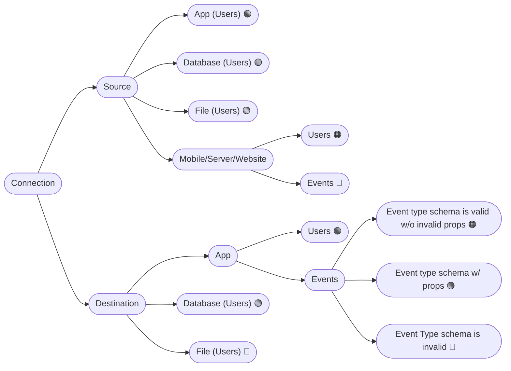

## Supported Targets by Role / Connection

> ⚠️ **Support for groups is incomplete and badly documented**. So, even where stated as implemented, may be not yet implemented nor tested.

| Role / Connection                         | Users            | Groups            | Events          |
|-------------------------------------------|------------------|-------------------|-----------------|
| Source **App**                            | Import users[^1] | Import groups[^1] | —               |
| Source **Database**                       | Import users     | Import groups     | —               |
| Source **File**                           | Import users     | Import groups     | —               |
| Source **Mobile / Server / Website**      | Import users     | Import groups     | Collect events  |
| Source **Storage**                        | —                | —                 | —               |
| Source **Stream**                         | —                | —                 | —               |
| Destination **App**                       | Export users[^1] | Export groups[^1] | Send events[^1] |
| Destination **Database**                  | Export users     | Export groups     | —               |
| Destination **File**                      | Export users     | Export groups     | —               |
| Destination **Mobile / Server / Website** | —                | —                 | —               |
| Destination **Storage**                   | —                | —                 | —               |
| Destination **Stream**                    | —                | —                 | —               |

[^1]: depends on the actual support by the app.

## Supported fields by Role / Connection / Target

> ⚠️ **Support for groups is incomplete and badly documented**. So, even where stated as implemented, may be not yet implemented nor tested.

Some notes about the table:

* The columns of the table do not necessarily refer to the fields of the action's fields in JSON/internal Chichi representations, but rather to their broader meaning. The purpose of this table is not to provide specifics on how information is represented, but rather to give an indication of the meaning of the various fields.
* The **Identity Resolution** procedure is **always executed every time an import action is executed**, so there is no need to specify a column on this.
* ⚠️ due to the issue [#311](https://github.com/open2b/chichi/issues/311), the considerations about transformations and schemas validity in this table do not necessarily correspond to the code.

| Role / Connection / Target                                 | Filter                                      | Input schema                                       | Output schema                                                             | Transformation ⚠️                                                                                                                                                                                                                                                                                   | Transformation function ⚠️                               | Action's schemas validity ⚠️                                                                                                                                                 | Misc                                                                                                  |
|------------------------------------------------------------|---------------------------------------------|----------------------------------------------------|---------------------------------------------------------------------------|----------------------------------------------------------------------------------------------------------------------------------------------------------------------------------------------------------------------------------------------------------------------------------------------------|---------------------------------------------------------|-----------------------------------------------------------------------------------------------------------------------------------------------------------------------------|-------------------------------------------------------------------------------------------------------|
| Source **App** on **Users / Groups**                       | —                                           | Read from the app                                  | `users_identities` (with no meta properties)                              | **Mandatory**. Chichi does not know how to map app properties on `users_identities` properties and does not let the import of users identities without properties                                                                                                                                  | Supported                                               | The input schema must be valid, because at least one property must be read from the app. Thus, since the transformation is mandatory, also the output schema must be valid. | —                                                                                                     |
| Source **Database** on **Users / Groups**                  | —                                           | Generated by executing the query                   | `users_identities` (with no meta properties)                              | **Mandatory**. Chichi does not know how to map properties from the table columns to `users_identities` properties and does not let the import of users identities without properties (see the proposal [#309](https://github.com/open2b/chichi/issues/309), even though it should not affect this) | Supported                                               | ? ? ?                                                                                                                                                                       | Query                                                                                                 |
| Source **File** on **Users / Groups**                      | —                                           | Read from file columns / headers                   | `users_identities` (with no meta properties)                              | **Mandatory**. Chichi does not know how to map the file columns to the `users_identities` properties and does not let the import of users identities without properties                                                                                                                            | Supported                                               | ? ? ?                                                                                                                                                                       | File path and sheet, identity column and (optionally) a timestamp column                              |
| Source **Mobile / Server / Website** on **Users / Groups** | —                                           | Events schema without GID (hard-coded into Chichi) | `users_identities` (with no meta properties)                              | **Optional**. May be reasonable to import users identities with just an userId and anonymousIds.                                                                                                                                                                                                   | Not supported                                           | In schema can be invalid, out schema, when a transformation is present, must be valid.                                                                                      | —                                                                                                     |
| Source **Mobile / Server / Website** on **Events**         | —                                           | —                                                  | —                                                                         | **Not allowed**. Incoming events should have a fixed schema, hard-coded into Chichi.                                                                                                                                                                                                               | *(does not apply as transformations are not supported)* | Both must be invalid, as transformation is not allowed.                                                                                                                     | —                                                                                                     |
| Destination **App** on **Users / Groups**                  | Filters the users to send to the app        | `users`                                            | Read from the app                                                         | **Mandatory**. Chichi does not know how to map `users` properties on app properties                                                                                                                                                                                                                | Supported                                               | ? ? ?                                                                                                                                                                       | Export mode and matching properties                                                                   |
| Destination **App** on **Events**                          | Filters the events to map and then send     | Events schema without GID (hard-coded into Chichi) | From the Event Type (may be invalid to indicate there is no schema)       | **Not allowed** when event type schema is invalid, **Optional** when the event type schema is valid and does not contain required properties **Mandatory** when the event type schema is valid and contains required properties                                                          | Supported                                               | ? ? ?                                                                                                                                                                       | —                                                                                                     |
| Destination **Database** on **Users / Groups**             | Filters the users to export to the database | `users`                                            | Read from the indicated table                                             | **Mandatory**. Chichi does not know how to map properties from the `users` table to the table columns                                                                                                                                                                                              | Supported                                               | ? ? ?                                                                                                                                                                       | Table name                                                                                            |
| Destination **File** on **Users / Groups**                 | Filters the users to write to the file      | `users`                                            | - *(not present as there are no transformations when exporting to files)* | **Not allowed**. The columns in the exported files match the properties of the `users` table                                                                                                                                                                                                       | *(does not apply as transformations are not supported)* | Input schema is unused and must be invalid, out schema must be valid (it was the `users` schema and it is used for the file schema).                                        | File path. Does it require a sheet? See the issue [#430](https://github.com/open2b/chichi/issues/430) |

## Transformations

**Legend**

* 🟢 = transformation is **mandatory**
* 🟠 = transformation is **optional**
* 🔴 = transformation is **not allowed**

