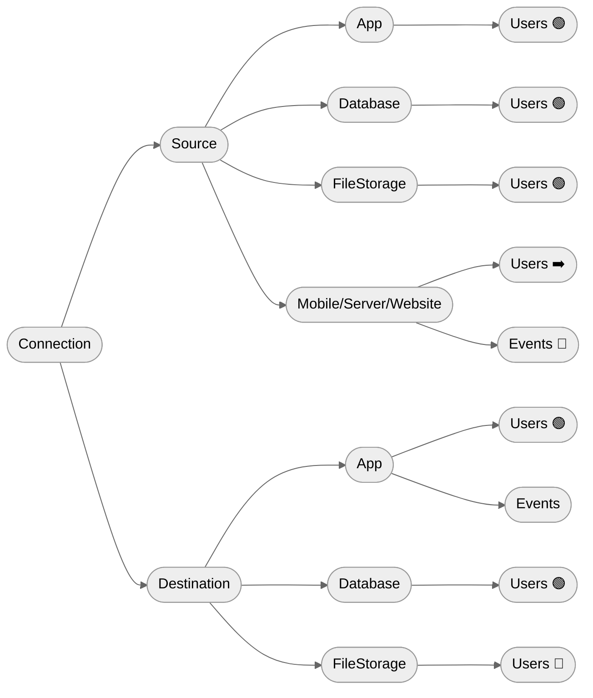

## Supported Targets by Role / Connection

> ⚠️ **Support for groups is incomplete and badly documented**. So, even where stated as implemented, may be not yet implemented nor tested.

| Role / Connection                         | Users            | Groups            | Events          |
|-------------------------------------------|------------------|-------------------|-----------------|
| Source **App**                            | Import users[^1] | Import groups[^1] | —               |
| Source **Database**                       | Import users     | Import groups     | —               |
| Source **FileStorage**                    | Import users     | Import groups     | —               |
| Source **Mobile / Server / Website**      | Import users     | Import groups     | Import events   |
| Source **Stream**                         | —                | —                 | —               |
| Destination **App**                       | Export users[^1] | Export groups[^1] | Send events[^1] |
| Destination **Database**                  | Export users     | Export groups     | —               |
| Destination **FileStorage**               | Export users     | Export groups     | —               |
| Destination **Mobile / Server / Website** | —                | —                 | —               |
| Destination **Stream**                    | —                | —                 | —               |

[^1]: depends on the actual support by the app.

## Actions details

> ⚠️ **Support for groups is incomplete and badly documented**. So, even where stated as implemented, may be not yet implemented nor tested.

| Role / Connection / Target                                 | Filter                                      | Expected properties within input schema              | Expected properties within output schema  | Misc                                                                                                                   |
|------------------------------------------------------------|---------------------------------------------|------------------------------------------------------|-------------------------------------------|------------------------------------------------------------------------------------------------------------------------|
| Source **App** on **Users / Groups**                       | —                                           | Read from the app                                    | `users` schema (with no meta properties)  | —                                                                                                                      |
| Source **Database** on **Users / Groups**                  | —                                           | Generated by executing the query                     | `users` schema (with no meta properties)  | Query, identity property and (optionally) a timestamp column                                                           |
| Source **FileStorage** on **Users / Groups**               | —                                           | Read from file columns / headers                     | `users` schema (with no meta properties)  | File path and sheet, connector, connector settings, compression, identity property and (optionally) a timestamp column |
| Source **Mobile / Server / Website** on **Users / Groups** | —                                           | `events` schema without GID (hard-coded into Chichi) | `users` schema (with no meta properties)  | —                                                                                                                      |
| Source **Mobile / Server / Website** on **Events**         | —                                           | —                                                    | —                                         | —                                                                                                                      |
| Destination **App** on **Users / Groups**                  | Filters the users to send to the app        | `users` schema                                       | Read from the app                         | Export mode and matching properties                                                                                    |
| Destination **App** on **Events**                          | Filters the events to map and then send     | `events` schema without GID (hard-coded into Chichi) | Schema of the Event Type (may be invalid) | —                                                                                                                      |
| Destination **Database** on **Users / Groups**             | Filters the users to export to the database | `users` schema                                       | Read from the indicated table             | Table name                                                                                                             |
| Destination **FileStorage** on **Users / Groups**          | Filters the users to write to the file      | —                                                    | —                                         | File path and sheet                                                                                                    |

## Guarantees on the actions in the Chichi's state

**Legend**

* 🟢 = the action **has a transformation** and there should be **at least one input property** (other than at least one output property)
* 🔴 = the action **does not have a transformation**
* ➡️ = if the action has a transformation, it is a mapping, not a transformation function

