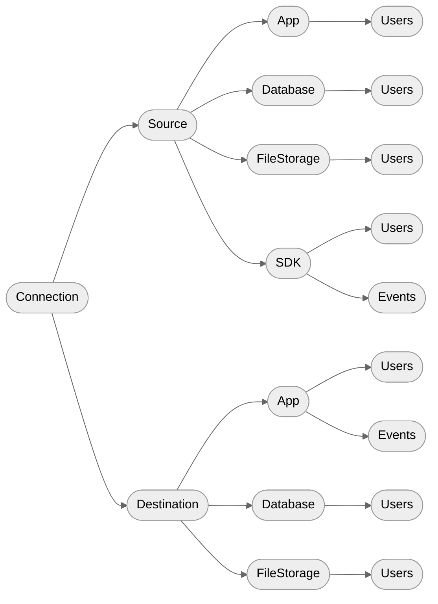

## Actions

Here is a list of supported combinations of action's roles / connection types / targets.

For specific information about them, see the file [Actions.csv](Actions.csv).

```mermaid
%%{init: {'theme':'neutral'}}%%
graph LR

	conn([Connection]) --> source([Source])
	conn --> dest([Destination])
	
	source --> source_app(["App"]) --> source_app_users(["Users"])
	source --> source_db(["Database"]) --> source_db_users(["Users"])
	source --> source_fileStorage(["FileStorage"]) --> source_fileStorage_users(["Users"])
	source --> source_events_based([SDK])
	
	source_events_based --> source_events_based_users(["Users"])
	source_events_based --> source_events_based_events(["Events"])
	
	dest --> dest_app([App])
	dest --> dest_db(["Database"]) --> dest_db_users(["Users"])
	dest --> dest_fileStorage(["FileStorage"]) --> dest_fileStorage_users(["Users"])
	
	dest_app --> dest_app_users(["Users"])
	dest_app --> dest_app_events([Events])
	

```

