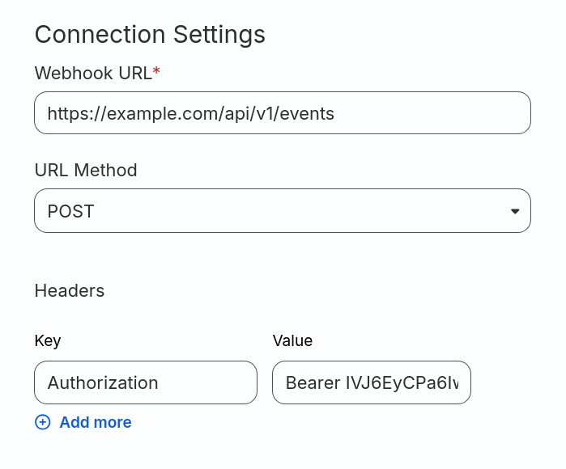


RudderStack data source


# RudderStack data source

The **RudderStack** data source allows you to receive events from RudderStack, including user information. Once events are received, you can:

- **Send events to destinations**: These are applications or services capable of processing the events.
- **Store events in the workspace's data warehouse**: Ideal for data analysis and reporting purposes.
- **Extract user data for identification**: Helps in identifying both authenticated and anonymous users, facilitating unification within the workspace's data warehouse.

RudderStack is an open-source customer data platform that helps businesses collect, unify, and send customer data to various tools for analytics, marketing, and personalization.

### On this page

* [Add a RudderStack data source](#add-a-rudderstack-data-source)
* [Add a Webhook destination on RudderStack dashboard](#add-a-webhook-destination-on-rudderstack-dashboard)

### Add a RudderStack data source

1. From the Meergo admin, go to **Connections > Sources**.
2. On the **Sources** page, click **Add new source**.
3. Search for the **RudderStack** source; you can use the search bar at the top or filter by category.
4. Click on the **RudderStack** connector. A panel will open on the right with information about **RudderStack**.
5. Click on **Add source**. The `Add RudderStack source connection` page will appear.
6. In the **Name** field, enter a name for the source to easily recognize it later.
7. Click **Add**.

Once the RudderStack data source is added, you will be directed to the **Actions** page, where you can view the specific actions that will be performed with the events received from this source.

### Add a Webhook destination on RudderStack web app

In the **RudderStack** source on Meergo:

1. Click the **Settings** tab.
2. Click **Event write keys**
3. Copy the **event write key** and the **endpoint**.

Then proceed to create a Webhook destination in RudderStack:

1. From the [RudderStack web app](https://app.rudderstack.com/), go to **Connect > Destinations**.
2. Click **New destination**.
3. Search for the **Webhook** destination; you can use the search bar at the top or filter by category.
4. On the Webhook page, in the **Name destination** field, enter a name for the destination to easily recognize it later.
5. Click **Continue**. 
6. Select the sources whose events you want to send to Meergo.
7. Click **Continue**.
8. Fill in the fields as follows:
   * **Webhook URL**: The endpoint you copied earlier
   * **URL Method**: **POST**
   * **Headers Key**: **Authorization**
   * **Headers Value**: **Bearer <EVENT_WRITE_KEY>** (where "<EVENT_WRITE_KEY>" is the write key you copied earlier)
9. Click **Continue** to create the destination.

The following image shows an example of how to fill in the fields:

