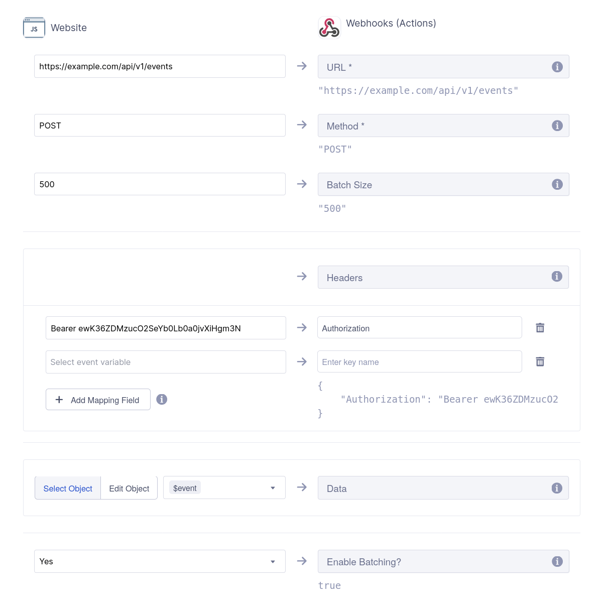


Segment data source


# Segment data source

The **Segment** data source allows you to receive events from Segment, including user information. Once events are received, you can:

- **Send events to destinations**: These are applications or services capable of processing the events.
- **Store events in the workspace's data warehouse**: Ideal for data analysis and reporting purposes.
- **Extract user data for identification**: Helps in identifying both authenticated and anonymous users, facilitating unification within the workspace's data warehouse.

Segment is a customer data platform that collects, unifies, and integrates customer data to improve analytics and personalization.

### On this page

* [Add a Segment data source](#add-a-segment-data-source)
* [Add a Webhook destination on Segment dashboard](#add-a-webhook-destination-on-segment-dashboard)

### Add a Segment data source

1. From the Meergo admin, go to **Connections > Sources**.
2. On the **Sources** page, click **Add new source**.
3. Search for the **Segment** source; you can use the search bar at the top to help you.
4. Next to the **Segment** source, click the **+** icon. The source addition page will open.
5. (Optional) In the **Name** field, enter a name for the source to easily recognize it later.
6. Click **Add**.

Once the Segment data source is added, you will be directed to the **Actions** page, where you can view the specific actions that will be performed with the events received from this source.

### Add a Webhook destination on Segment dashboard

In the **Segment** source on Meergo:

1. Click the **Settings** tab.
2. Click **Event write keys**
3. Copy the **event write key** and the **endpoint**.

Then proceed to create a Webhook destination in Segment: 

1. From the [Segment dashboard](https://app.segment.com/workspaces), go to **Connections > Destinations**. 
2. Click **Add destination**.
3. Search for the **Webhook** destination; you can use the search bar at the top to help you.
4. Click **Add destination** on the Webhook page.
5. Select the data sources whose events you want to send to Meergo.
6. Click **Next**.
7. In the **Destination name** field, enter a name for the destination.
8. Click **Create destination**.
9. On the connection page, click the **Mappings** tab.
10. Click **New Mapping**.
11. Select the **Send** action.
12. On the action page, fill in the fields as follows:
   * **URL**: The endpoint you copied earlier.
   * **Method**: POST
   * **Batch Size**: 500
   * **Headers**:
     1. Click **Add Mapping Field**
     2. Enter "**Bearer <EVENT_WRITE_KEY>**" on the left, where "<EVENT_WRITE_KEY>" is the write key you copied earlier
     3. Enter **Authorization** on the right
   * **Enable Batching**: Yes
13. Click **Save** to create the action.
14. Click the switch corresponding to the action to enable it. 

The following image shows an example of how to fill in the fields:

