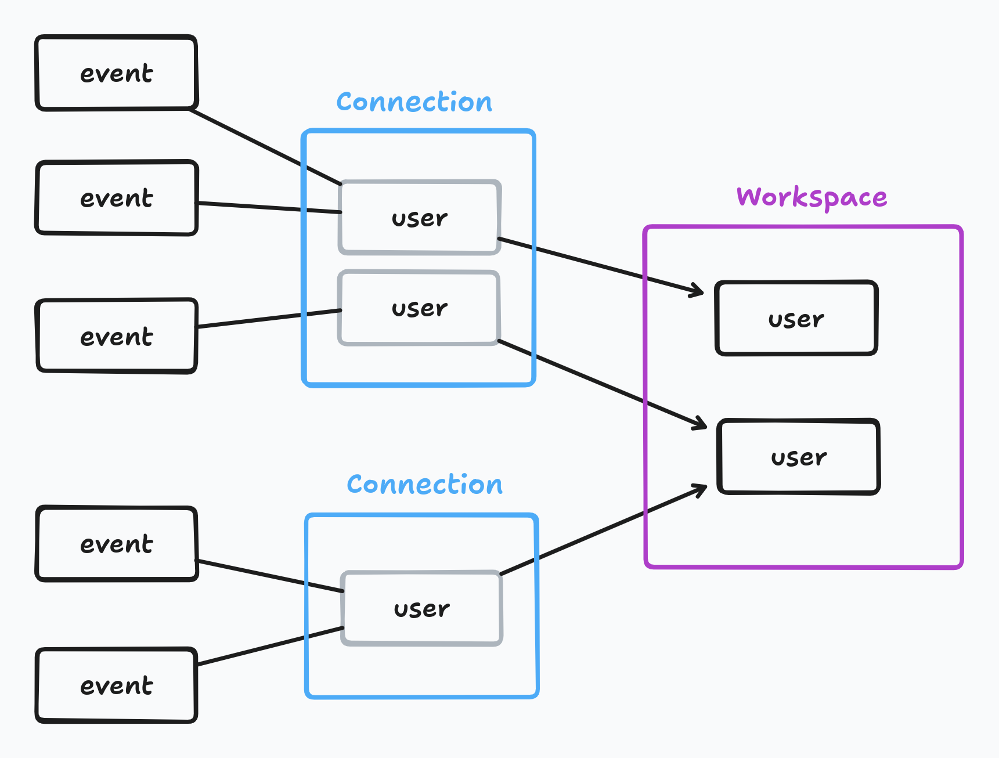

# Workspace Identity Resolution

The Workspace Identity Resolution determines if more users, belonging to **any connection** of the workspace (even the same connection), are a single user of the workspace, and eventually merges them. It also associates the workspace users to the events stored in the data warehouse.

This procedure is started arbitrarily by Chichi and cannot be started explicitly by the user.

>  We have a discussion on that, [#354](https://github.com/open2b/chichi/issues/354).

## Same user criterion

> NOTE: this paragraph should be reviewed and eventually clarified.

Given two users, they are the *same user* if they have at least one equal value for an **identifier**, and if at least one of the users have no value for identifiers with higher priority.

Hence, it follows that if there are no identifiers defined in the workspace, the Workspace Identity Resolution considers every user imported from a connection always different from any other user.

## Identifiers

An identifier consists in **a property path** which refers to a property of the `users_identities` schema which have [an allowed type](./allowed-types-for-identifiers.md).

It is possible to define zero, one, or more identifiers for the identity resolution. 

There are two types of identifiers: **non-anonymous** and **anonymous**. The difference is not related to the identity resolution – which treats both in the same way – but to how corresponding values for the users are imported.

> The properties shown in the UI are currently wrong. See the issue [#320](https://github.com/open2b/chichi/issues/320). 


### Non-anonymous Identifiers

Non-anonymous identifiers can be chosen from the properties of the `users_identities` schema.

It is necessary to choose a **priority order**, which will be taken into account by the identity resolution procedure.

So, for example:

```
[ 1 ]  customerId
[ 2 ]  taxCode
[ 3 ]  email
[ 4 ]  address.street1
```

### Anonymous Identifiers

The anonymous identifiers, like non-anonymous ones, are identifiers that refer to the properties of the `users_identities` schema properties and **have lower priority** than the former.

Here, in addition to choosing these identifiers, it is necessary to **specify a mapping between incoming event properties and the chosen anonymous identifiers**. This mapping will be executed when importing traits of an incoming event. 

```
┌────────────────────────┐
│ context.device.id      │ ->  [ 1 ]  ios.id
└────────────────────────┘
┌────────────────────────┐
│ context.ip             │ ->  [ 2 ]  ip
└────────────────────────┘
```

**So, why using anonymous identifiers?** They are useful to avoid repeating the same [mapping](../mapping.md) on anonymous properties (device IDs, etc...) in every action that import user traits from events. Consequently, as can be deduced, the behavior of anonymous identifiers can be replaced with non-anonymous identifiers and mappings within actions.

## Merging of users

In the Workspace Identity Resolution, users are merged by taking the `max` value between the values of the properties for the users.

> `max` refers to the `max` function in PostgreSQL, which [is documented here](https://www.postgresql.org/docs/current/tutorial-agg.html).

For example, consider two users with the properties `email`, `name` and `totalOrders`, which are considered *the same user* by the Workspace Identity Resolution and thus must be merged:

| email | name     | totalOrders |
|-------|----------|-------------|
| a@b   | John     | 10          |
| a@b   | *(null)* | 20          |

The resulting user of the workspace will be:

| email | name | totalOrders |
|-------|------|-------------|
| a@b   | John | 20          |

## Association between events and users

From the same connection which receives events, can both be imported users (through the users traits) and events, using different actions. The Workspace Identity Resolution, as mentioned before, also associated events to the users of the workspace.

Every event is associated to the **users incoming from the same connection** which:

* have the same `userId` (in case of non-anonymous events)
* or have an `anonymousId` in common (in case of anonymous events).

At that point, since users from multiple connections have been merged together through the Workspace Identity Resolution, **events from different connections can be associated to the same workspace user**.

