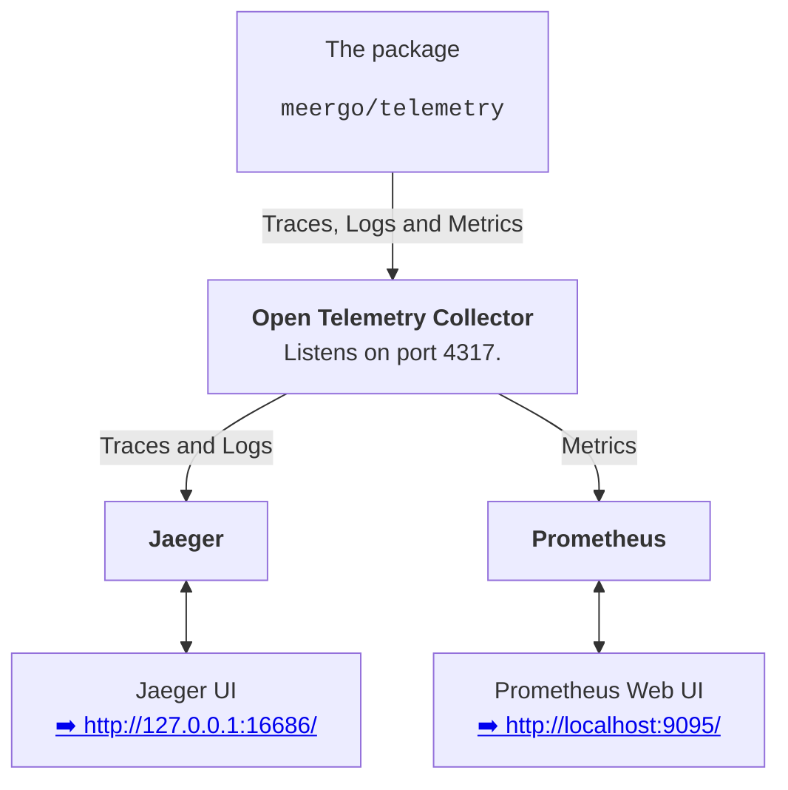

# Telemetry

Telemetry in Meergo consists in **four** major **components**:

* this Go package (`meergo/telemetry`)
* the [OpenTelemetry Collector](https://opentelemetry.io/docs/collector/) – for collecting **traces, logs and metrics**
* [Jaeger](https://www.jaegertracing.io/) – for handling and querying **traces and logs**
* [Prometheus](https://prometheus.io/) – for handling and querying **metrics**



**Table of contents**:

- [Abstract](#abstract)
- [Installing and running the OpenTelemetry Collector](#installing-and-running-the-opentelemetry-collector)
  - [Installing](#installing)
  - [Running](#running)
- [Installing and running Jaeger (all in one)](#installing-and-running-jaeger-all-in-one)
  - [Installing](#installing-1)
  - [Running](#running-1)
  - [Accessing the Jaeger UI](#accessing-the-jaeger-ui)
- [Installing and running Prometheus](#installing-and-running-prometheus)
  - [Installing](#installing-2)
  - [Running](#running-2)
  - [Accessing the Prometheus UI](#accessing-the-prometheus-ui)

## Abstract

The following sections indicate how to **install** and **run** the three
components necessary to enable telemetry in Meergo, that are:

* the **OpenTelemetry Collector**
* **Jaeger**
* **Prometheus**

## Installing and running the [OpenTelemetry Collector](https://opentelemetry.io/docs/collector/)

### Installing

Follow the instructions at https://opentelemetry.io/docs/collector/getting-started/.

> When unpacking the archive with the release, it should be enough to keep /
> install the file `otelcol` (or `otelcol.exe`) and throw everything else.

At the end of the setup, you should be able to run the `otelcol` command:

```bash
otelcol --version
```

which should output something like:

```
otelcol version 0.81.0
```

### Running

From this directory (the directory `telemetry` in the repository), run:

```bash
otelcol --config confs/otelcol.yaml
```

which will run the collector on the port **4317**.

> ⚠️ The OpenTelemetry Collector may print some *connection refused* errors in
> its output. That may depend on the fact that Jaeger is still not running, and
> so these errors should be resolved when Jaeger is started.

## Installing and running [Jaeger](https://www.jaegertracing.io/) (all in one)

### Installing

Go to https://www.jaegertracing.io/, go to `Docs` > `Getting started` [^1] and
follow the instructions for installing **Jaeger All in One**.

[^1]: A note for the maintainers of this README: the direct link to the
installing page contains in the URL of current Jager version, so it is better to
not include it in this README to avoid the needing of keeping it up-to-date.

> When unpacking the archive with the release, it should be enough to keep /
> install the file `jaeger-all-in-one` (or `jaeger-all-in-one.exe`) and throw
> everything else.

Now you should be able to run the `jaeger-all-in-one` command, printing its version:

```bash
jaeger-all-in-one version
```

### Running

From this directory (the directory `telemetry` in the repository), run:

```bash
jaeger-all-in-one --collector.otlp.enabled=0
```

> Note that Jaeger is be executed **without its collector** (passing the
> `--collector.otlp.enabled=0` option to it), as the Open Telemetry Collector it
> is used instead.

### Accessing the Jaeger UI

Visit [➡️ http://127.0.0.1:16686/](http://127.0.0.1:16686/).

## Installing and running [Prometheus](https://prometheus.io/)

### Installing

You can download the Prometheus builds from https://prometheus.io/download/.

> When unpacking the archive with the release, it should be enough to keep /
> install the file `prometheus` (or `prometheus.exe`) and throw everything else.

After installing it, you should be able to run the `prometheus` command to check
the installed version:

```bash
prometheus --version
```

which should output something like:

```
prometheus, version 2.46.0 (branch: HEAD, revision: cbb69e51423565ec40f46e74f4ff2dbb3b7fb4f0)
  build user:       root@42454fc0f41e
  build date:       20230725-12:31:24
  go version:       go1.20.6
  platform:         linux/amd64
  tags:             netgo,builtinassets,stringlabels
```

### Running

From this directory (the directory `telemetry` in the repository), run:

```bash
prometheus --config.file=confs/prometheus.yml --web.listen-address="0.0.0.0:9095"
```

> ⚠️ This command may create a directory `data` within this directory. You
> should add such directory to your `.gitignore` file.

> We execute the web UI of Prometheus on the port **9095** (through the option
> `--web.listen-address="0.0.0.0:9095"`) because the port **9090** is usually
> used by Meergo.

### Accessing the Prometheus UI

Visit [➡️ http://localhost:9095/](http://localhost:9095/).